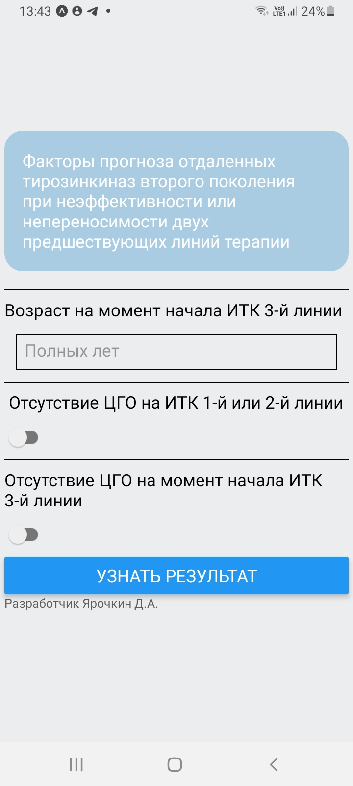
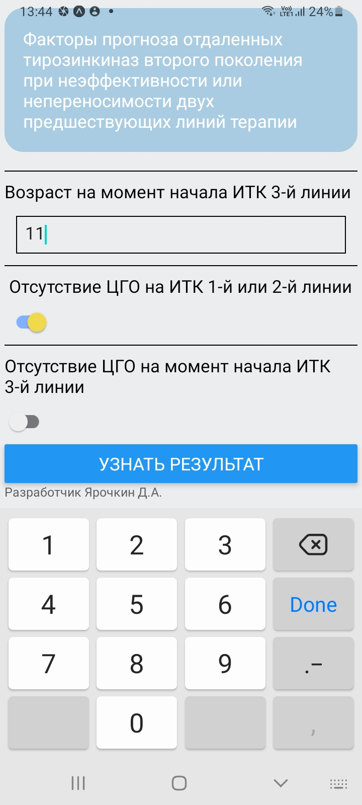
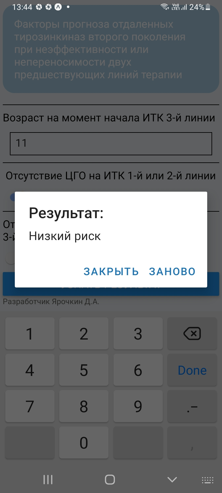

    Эта программа производит подсчет баллов согласно методике:

## Факторы прогноза отдаленных тирозинкиназ второго поколения при неэффективности или непереносимости двух предшествующих линий терапии

# Методика:

| Прогностический фактор |  Балл|
|-------------------------|-------------------------------------|
|Возраст на момент начала ИТК 3-й линии (для каждых 10 лет)| 1 |
|Отсутствие ЦГО на ИТК 1-й или 2-й линии| 8 |
|Отсутствие ЦГО на момент начала ИТК 3-й линии| 7|

    "После расчета суммы баллов для каждого пациента мы разделили пациентов на три группы: низкого риска
    (сумма баллов ≤9, n=22), промежуточного риска (сумма баллов от 10 до 15, n=27) и высокого риска (сумма баллов ≥16, n=24).

    У пациентов в группе высокого риска отмечалась значимо более низкая частота достижения
    ПЦГО на ИТК 3-й линии по сравнению с группой промежуточного риска (1/24 (4%) по сравнению с 7/27
    (26%), p=0,033), в свою очередь группа промежуточного риска имела значимо худшие результаты по   }
    сравнению с группой низкого риска (7/27 (26%) по сравнению с 14/22 (64%), p=0,008)"

# Вид приложения:

**Стартовое положение**

Положение с введенными данными

Пример результата

  