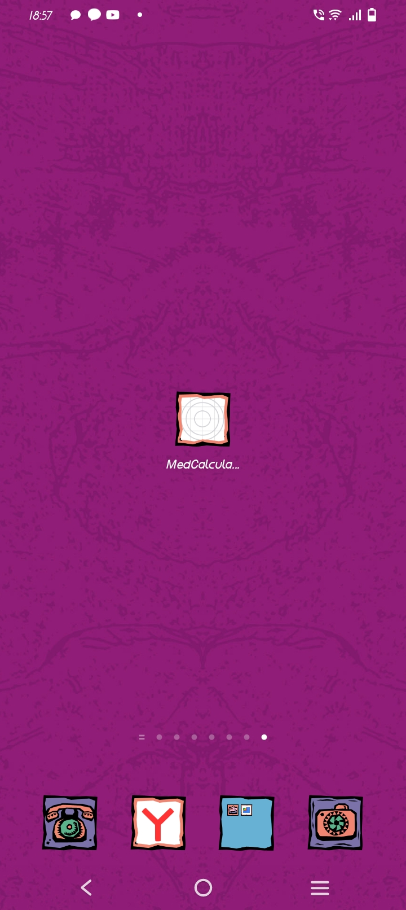

# README

This is a React Native app that  implements scoring system of non-achieving CCyR on second-generation TKIs in third line therapy CP CML

| Prognostic factor | Score|
|--------------------------| --- |
|Age at start of 3rd line TKI (per 10 years)| 1|
| Absence of CyR on 1st line or 2nd line TKI | 8|
| Absence of CyR prior to 3rd line TKI| 7|

The assessment of probability of not achieving CCyR according to total score.
After calculation the total score for each patient we divided the patients into two groups: the low
risk (total score ≤10, the high risk (total score ≥11) The patients of the high-risk group had
significantly lower rate of achieving CCyR on third line TKI compared low-risk ,

Getting started

# To run the app locally, follow these steps:

- Clone this repository: git clone git@github.com:yarov475/med.git 
- Install dependencies: npm install
- Start the development server: expo start
# To run app on Android

-   Download med-calculator.apk file from  the APK folder to your device.
-     Install the downloaded APK file.
-    Tap twice on the icon of the app to open it.

The app should open in your default browser, and you can use an emulator or scan the QR code with the Expo app on your phone to launch the app.
Usage

After launching the app, you will see a form that asks for the patient's age at the start of third-line TKI therapy and two Switch components that ask whether the patient did not achieve CCyR on first or second-line TKI therapy and whether the patient did not achieve CCyR prior to third-line TKI therapy.

Enter the required information, and then click the 'Submit' button to see the result, which indicates the group of risk. The app also includes options to reset the form and change the language (English or Russian).
# Application UI:

App icon on smartphone screen

Interface in English

Interface in Russian

Error in English

Error in Russian

   Low risk in English

Low risk in Russian

High risk in english

High risk in Russian

`This app was developed by Dmitry A. Yarochkin` 

*************************************************

Это приложение React Native,   Эта программа производит подсчет баллов согласно методике:

## Факторы прогноза отдаленных результатов терапии ингибиторами тирозинкиназ второго поколения в третьей линии терапии хронической фазы хронического миелоидного лейкоза

# Методика:

| Прогностический фактор                   |  Балл|
|---------------------------------------------------------|-------------------------------------|
| Возраст на момент начала ИТК 3-й линии (для каждых 10 лет) | 1 |
| Отсутствие ЦО на ИТК 1-й или 2-й линии                  | 8 |
| Отсутствие ЦО на момент начала ИТК 3-й линии            | 7|

    "После расчета суммы баллов для каждого пациента мы разделили пациентов на три группы: низкого риска
    (сумма баллов ≤9, n=22), промежуточного риска (сумма баллов от 10 до 15, n=27) и высокого риска (сумма баллов ≥16, n=24).

    У пациентов в группе высокого риска отмечалась значимо более низкая частота достижения
    ПЦО на ИТК 3-й линии по сравнению с группой промежуточного риска (1/24 (4%) по сравнению с 7/27
    (26%), p=0,033), в свою очередь группа промежуточного риска имела значимо худшие результаты по   }
    сравнению с группой низкого риска (7/27 (26%) по сравнению с 14/22 (64%), p=0,008)"

# Чтобы запустить приложение локально, выполните следующие действия:

- Клонируйте этот репозиторий: git clone https://github.com/dmitry-yarochkin/non-achieving-ccyr-app.git
- Установить зависимости: установка npm
- Запустите сервер разработки: запуск выставки
# Для запуска приложения на Android

- Загрузите файл med-calculator.apk из папки APK на свое устройство.
- Установите загруженный APK-файл.
- Нажмите дважды на значок приложения, чтобы открыть его.

Приложение должно открыться в вашем браузере по умолчанию, и вы можете использовать эмулятор или отсканировать QR-код с помощью приложения Expo на своем телефоне, чтобы запустить приложение.
Применение

После запуска приложения вы увидите форму, в которой запрашивается возраст пациента на момент начала терапии ИТК третьей линии, и два компонента Switch, в которых запрашивается, не достиг ли пациент CCyR при терапии ИТК первой или второй линии и был ли пациент не достигли CCyR до терапии ИТК третьей линии.

Введите необходимую информацию, а затем нажмите кнопку «Отправить», чтобы увидеть результат, в котором указана группа риска. Приложение также включает в себя опции для сброса формы и изменения языка (английский или русский).

# Вид приложения:

Иконка приложения на экране смартфона

Интерфейс на английском

интерфейс на русском

Ошибка на аглийском

Ошибка на русском

    Низкий риск на английском

 

  Высокий риск на английском

Высокий риск на русском

 
`Это приложение было разработано Дмитрием А. Ярочкиным`